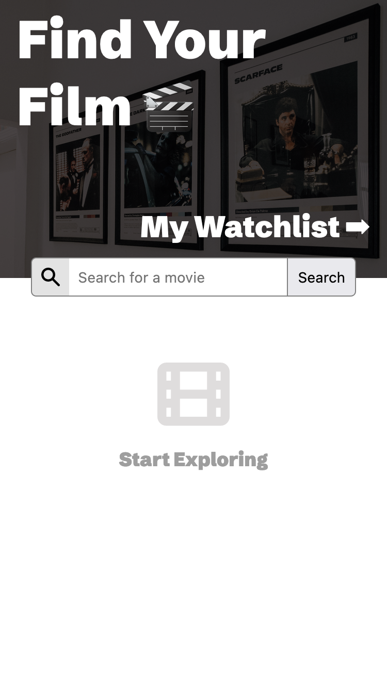
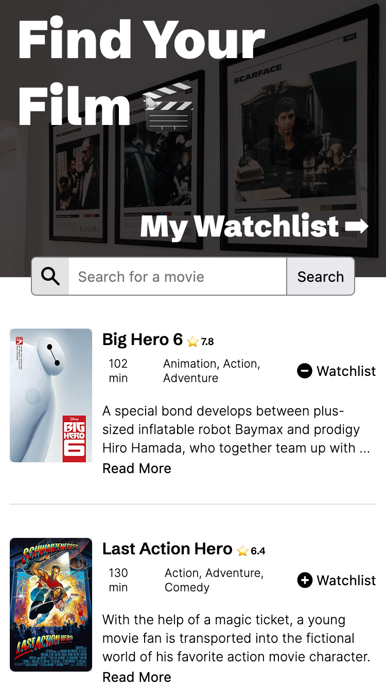
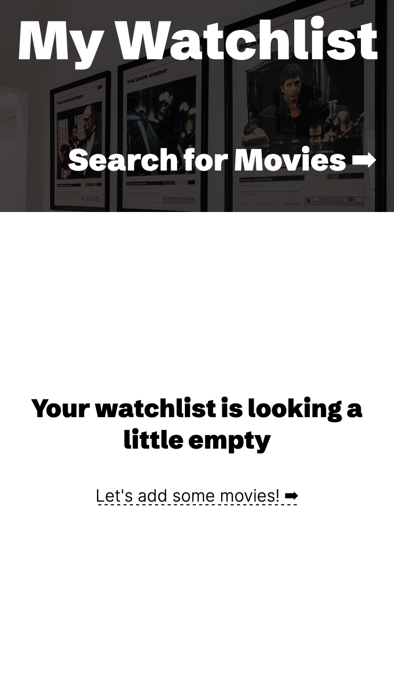
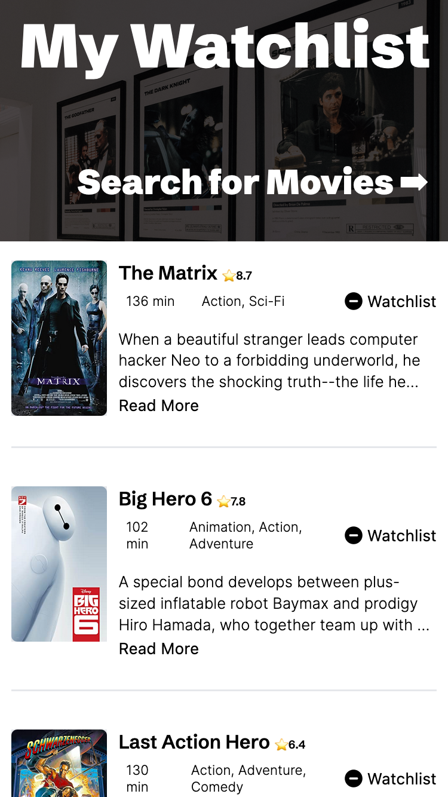

# Scrimba Solo Project - Movie Watch List

## Live Version >> ➡️ [View Here](https://rapidisimo.github.io/Movie-Watchlist/)

## Requirements
1. Create two pages. index.html and watchlist.hml
2. index.html = Search Page - Calls to OMDB API with the title searched for and displays results
3. On the serach results page each movie should have a "Watchlist" button which adds the movie to a watchlist. This saves that data to local storage
4. Watchlist.html loads and displays data from local storage

## Additional Features I added
1. Ability to add and remove movie from watchlist directly from search results. Icon changes to - which lets the user know the movie is in the watchlist. Clicking it again removes it from the watchlist and changes the icon back to a +. If a movie is already in the watchlist and it comes up during a search the icon will be - so the user can remove it.
2. Constrain plot descriptions that are too long and provide a "Read More" link to expand the plot text.
3. By default the OMDB API provides only ten results. I added a "More Results" button at the bottom of the results to continue querying the API. If there are no more results the button changes to "No Results Left" and is disabled.

## Preview

